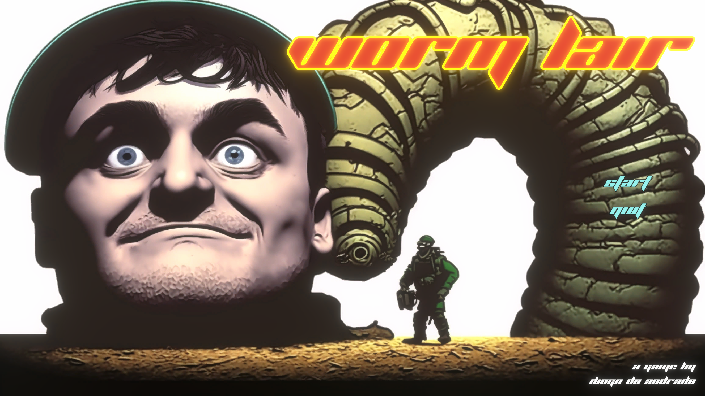

# WORMLAIR

Developed for the Game Creator's Club at Lusofona University.
This month, the theme was "Single Screen Game". I wan't going to enter this month because I'm really late with other
work, but a student of mine decided to push me, and as a result I built this completely unbalanced monstrosity in his
honor.

This uses a mix of custom scripts and the [OkapiKit], a no-code kit bashing system I'm working on for the students.

## License

* All game source code by Diogo de Andrade is licensed under the [MIT] license.
* [OkapiKit] by Diogo de Andrade, available through the [MIT] license.
* [NaughtyAttributes] by Denis Rizov, available through the [MIT] license.
* Arena tileset by [ZiNGOT], available throught the [CC-BY 3.0] license.
* Top-down buildings by [chabull], licensed under [CC-BY 3.0]
* Font by [The Planet], licensed under CD-Ware (free for non-comercial use)
* All the remaining sprites by Diogo de Andrade, available throught the [CC0] license.

## Metadata

* Autor: [Diogo Andrade]

[Diogo Andrade]:https://github.com/DiogoDeAndrade
[OkapiKit]:https://github.com/VideojogosLusofona/OkapiKit
[NaughtyAttributes]:https://github.com/dbrizov/NaughtyAttributes
[Midjourney]:https://www.midjourney.com/home/
[ZiNGOT]:https://opengameart.org/content/alien-breed-esque-top-down-tilesheet
[chabull]:https://opengameart.org/users/chabull
[CC0]:https://creativecommons.org/publicdomain/zero/1.0/
[CC-BY 3.0]:https://creativecommons.org/licenses/by/3.0/
[The Planet]:http://planet.dk/
[MIT]:LICENSE
